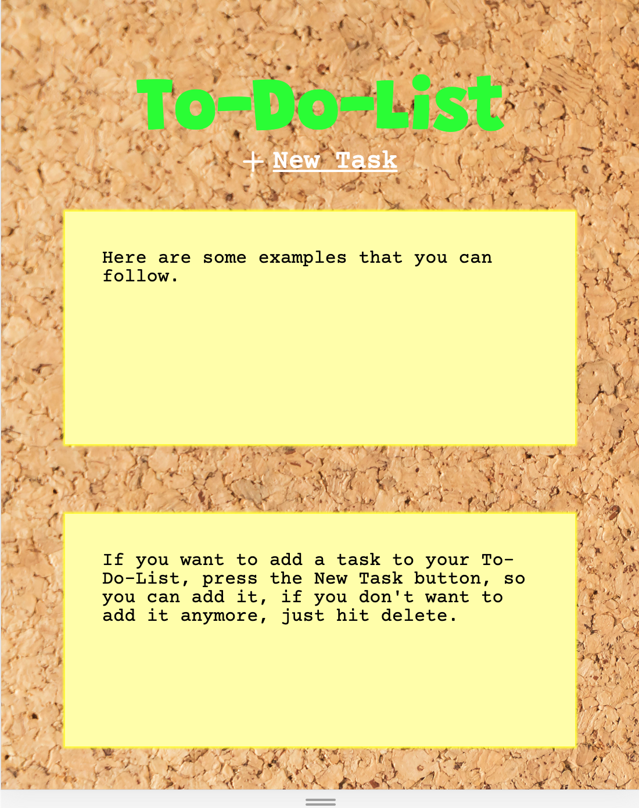

# Welcome! 👋

Since I'm an organized person, I like to always know what I need to do in the day so I created this To-Do-List to help me with my daily routines.
 
You can checkout the demo here : <strong><a href="https://gustavomatsunaga.github.io/ToDoList/" target="_blank">To Do List</a></strong>

## Challenges! :pushpin:

The application was developed with only HTML, CSS and vanilla Javascript. I made a CRUD (Create, read, update and delete) application in order to maintain my daily routines organized. The website is completely responsive, so it can fit even for mobiles.
The greatest challenge was only using a Single Page to build the application, so it doesn't need to refresh. The application needed a lot of DOM manipulation in order to fulfill this.

**Features! Let's have fun!** 🚀

<ul>
    <li>View the optimal layout for the component depending on their device's screen size (Responsive Web Design)</li>
    <li>New Task Button => Add a new task</li>
    <li>Double Click => Edit or delete the Task</li>
</ul>

## Technologies! :computer:

<ul>
    <li>HTML</li>
    <li>SASS</li>
    <li>JAVASCRIPT</li>
</ul>

# Web Model
## Model

## Desktop

## Mobile

